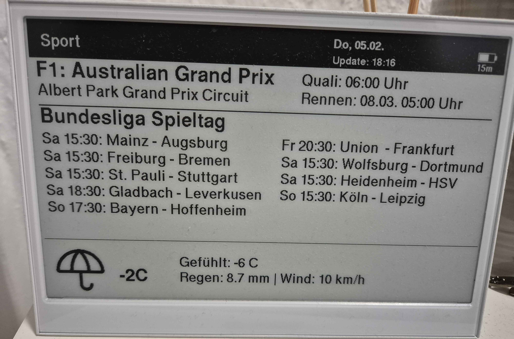

# Smart Home Dashboard (reTerminal E1001 / ESP32)

Ein E-Ink Dashboard für Berlin und Umgebung, basierend auf dem Seeed reTerminal E1001 (XIAO ESP32-S3). Es zeigt aktuelle ÖPNV-Daten, Verkehrslage, Wetter, Nachrichten und Sport-Ergebnisse an.

## Features

*   **ÖPNV (BVG/VBB):** Zeigt die nächsten Abfahrten einer konfigurierten Haltestelle inkl. Verspätungen. Filtert Abfahrten, die zu Fuß nicht mehr erreichbar sind.
*   **Verkehr (Google Maps):** Berechnet die aktuelle Fahrzeit mit dem Auto zur Arbeit/nach Hause (Traffic Model: best guess).
*   **Wetter:** Aktuelle Temperatur, gefühlte Temperatur, Wind & Regen (Open-Meteo API).
*   **Nachrichten:** Die aktuellen Schlagzeilen der Tagesschau (API v2).
*   **Sport:**
    *   **Formel 1:** Nächstes Rennen, Qualifying- & Rennzeiten (Jolpica API).
    *   **Bundesliga:** Aktueller Spieltag und Live-Ergebnisse (OpenLigaDB).
    *   **Strava:** Letzte Aktivität (Laufen/Rad) und Jahresstatistiken.
*   **Energieeffizienz:** Deep Sleep Management basierend auf der Tageszeit (Nachtmodus).

## Hardware

*   **Gerät:** Seeed reTerminal E1001 oder Seeed XIAO ESP32S3
*   **Display:** E-Ink Display (GxEPD2)

